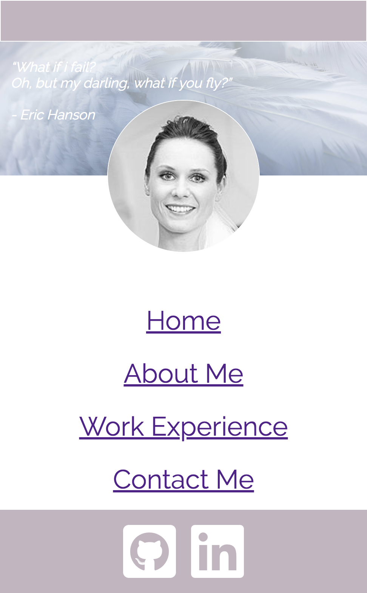

# A link (URL) to Fiona's published portfolio website
https://fionatolliday.github.io/index.html

# A link to Fiona's  GitHub repository
https://github.com/fionatolliday/fionatolliday.github.io

# DESCRIPTION OF FIONA'S PORTFOLIO WEBSITE:
# Purpose:
To build and deploy a website that will show my skills not only as a developer using HTML and CSS, but also to showcase my educational and professional skills.  The website will allow users to see my personality, but also be able to click through to my github and linkedin accounts to view further information relating to my work and career.

# Functionality / features:
This website has four pages of content which can be toggled via the nav bar.
 
The home page is responsive for mobile with the use of media queries.  Media queries enable to quote to move between the header image and the main content section.  A media query also enables the nav bar to move from the centre main area up to the rop right below the header image.
 
The home page quote features "lightening" animation, however this is only functional using Firefox.
 
Each page contains logo click-throughs direct to mylinked profile and github account set in the footer.

# Sitemap:
Home
About Me
Work Experience
Contact Me

# Screenshots:

# Target audience:
Primary target: head hunters
Secondary target: those looking for further information on me

# Tech stack (e.g. html, css, deployment platform, etc):
The technology used to build my portfolio website is HTML and CSS.
 
 

# DESIGN DOCUMENTATION INCLUDING:
# Design process:
Pinterest was my inspiration of this page. 
I like crisp, clean and calming colours, so spent time looking at white and feathers. 
The feathers add an element of texture, but softness which complements the calming colours.  
The colours selected were chalky colours that are somewhat muted, in line with the calming theme.

# Wireframes:

# Personal logo (optional):
No logo included in the website.  
Instead, I opted to use an image of myself on each page.

# Usability considerations:
The home page has been made to be responsive between desktop and mobile with the use of media queries.
 
However, due to lack of time, this functionality has not carried across to the remaining three pages, therefore the nav bar falls at various sections on each page and does not manipulate for smaller screen readibility.
 
The home page also has animation, however this is not compatible with Chrome and needs to be viewed in Firefox.

# DETAILS OF PLANNING PROCESS INCLUDING:
# Project plan & timeline:
Pre-work included the creation of a mood board via Pinterest and starting to think about wireframes in Figma  
Day 1: finalising wireframes and getting teacher approval to build. Also populating Trello  
Day 2: build the HTML and CSS for page 1 and page 2 
Day 3: build the HTML and CSS for page 3 and page 4 
Day 4: test and fix.  Complete necessary admin 
Finalise: git hub, deploying and handing in assignment for grading.

# Screenshots of Trello board(s):

# SHORT ANSWER Q&A:
# Describe key events in the development of the internet from the 1980s to today (max. 150 words):

# Define and describes the relationship between fundamental aspects of the internet such as: domains, web servers, DNS, and web browsers (max. 150 words):

# Reflect on one aspect of the development of internet technologies and how it has contributed to the world today (max. 150 words):